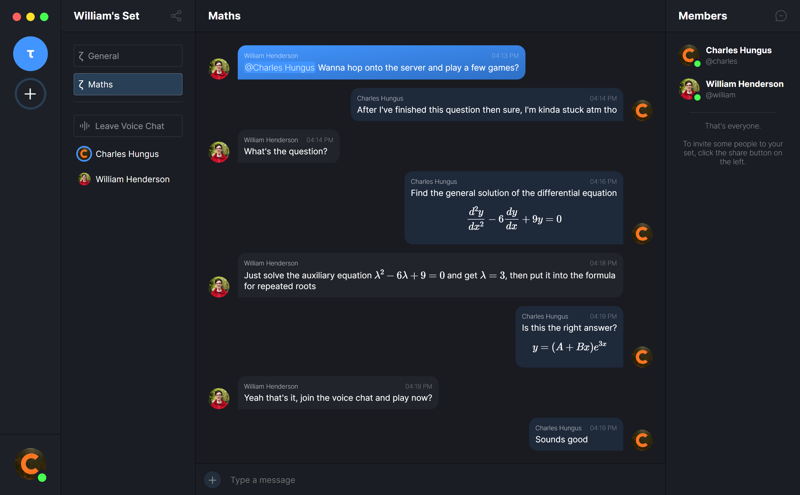

  

  <h3 align="center">Equion</h3>

  

    Integrate Together. 
    <a href="https://equion.whenderson.dev"><strong>Download Now »</strong></a> ·
    <a href="https://docs.equion.whenderson.dev">API Documentation</a>
  
 

  
    

 

Equion is a chat platform, similar to Discord, but built with mathematics in mind. It has built-in support for LaTeX and Markdown, high-quality low-latency voice chat and screen sharing, and is lightweight and lightning-fast thanks to Rust and Tauri.

## Services

All of Equion's custom services are built with Rust where possible and have maths-based names which are vaguely related to their functionality.

| Name | Description | Tech Stack |
| --- | --- | --- |
| [Domain](https://github.com/w-henderson/Equion/tree/master/domain) | The core Equion server, providing the API and interfacing with the database. | Rust, Humphrey, MySQL |
| [Range](https://github.com/w-henderson/Equion/tree/master/range) | The Equion front-end, providing the user interface | Rust, Tauri, React, TypeScript, Sass |
| [Bijection](https://github.com/w-henderson/Equion/tree/master/bijection) | JavaScript bindings to the Equion API, used by the front-end | TypeScript |
| [Axiom](https://github.com/w-henderson/Equion/tree/master/axiom) | The Equion website | React, Gatsby, TypeScript, Sass |
| [Matrix](https://github.com/w-henderson/Equion/tree/master/matrix) | Release manager, used to publish and retrieve Equion releases | Rust, Humphrey, JasonDB |
| Database | The Equion database | MySQL |
| Voice | The Equion voice chat server | PeerJS, WebRTC |
| Gateway | The Equion gateway | NGINX |

## Use Equion

As of July 2023, I'm no longer hosting Equion, so you'll need to host your own server:

1. Install Docker and Docker Compose on the server.
2. `git clone https://github.com/w-henderson/Equion && cd Equion`.
3. `docker-compose build`
4. `docker-compose -f docker-compose.prod.yml up -d`.

To configure the client to connect to your server, add an entry in `range/src/servers.json`.

## Screenshot

